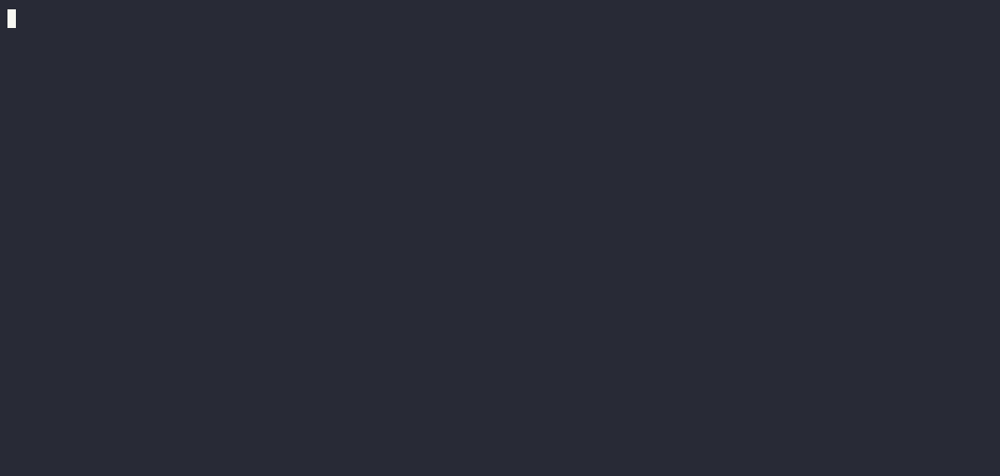

<a id="readme-top"></a>
<!-- PROJECT SHIELDS -->
[![Contributors][contributors-shield]][contributors-url]
[![Forks][forks-shield]][forks-url]
[![Stargazers][stargazers-shield]][stargazers-url]
[![Commit activity][commit-activity-shield]][commit-activity-url]
[![Branch action runs][branch-action-runs-shield]][branch-action-runs-url]
[![Issues][issues-shield]][issues-url]
[![License][license-shield]][license-url]

<!-- PROJECT LOGO -->
<br />
<div align="center">
  <a href="https://github.com/elcoosp/readma">
    
  </a>
  <h3 align="center">Readma</h3>
  <p align="center">
    Beautiful effortless README generator
    <br />
    <a href="https://github.com/elcoosp/readma"><strong>Explore the docs »</strong></a>
    <br />
    <br />
    <a href="https://github.com/elcoosp/readma">View Demo</a>
    ·
    <a href="https://github.com/elcoosp/readma/issues/new?labels=bug&template=-bug-report--from-readme.md">Report Bug</a>
    ·
    <a href="https://github.com/elcoosp/readma/issues/new?labels=enhancement&template=feature-request---from-readme.md">Request Feature</a>
  </p>
</div>

<!-- TABLE OF CONTENTS -->
<details>
  <summary>Table of contents</summary>
  <ol>
   <li><a href="#about-the-project">About the project</a></li>
   <li><a href="#getting-started">Getting started</a></li>
   <li><a href="#installation">Installation</a></li>
   <li><a href="#usage">Usage</a></li>
   <li><a href="#roadmap">Roadmap</a></li>
   <li><a href="#contributing">Contributing</a></li>
   <li><a href="#license">License</a></li>
   <li><a href="#contact">Contact</a></li>
   <li><a href="#acknowledgments">Acknowledgments</a></li>
  </ol>
</details>

## About the project


  
Create README that rocks

## Getting started

See screenshot

## Installation

```sh
deno install @readma/core
```

## Usage

See `scripts/gen-readme.ts`

## Roadmap

- [ ] CLI with config file
- [ ] Auto defaults from known files like Cargo.toml/{deno,package}.json

See the [open issues](https://github.com/elcoosp/readma/issues) for a full list of proposed features (and known issues).

## Contributing

Contributions are what make the open source community such an amazing place to learn, inspire, and create. Any contributions you make are **greatly appreciated**.

If you have a suggestion that would make this better, please fork the repo and create a pull request. You can also simply open an issue with the tag "enhancement".
Don't forget to give the project a star! Thanks again!

1. Fork the Project
2. Create your Feature Branch (`git checkout-b feat/AmazingFeature`)
3. Commit your Changes (`git commit -m 'Add some AmazingFeature'`)
4. Push to the Branch (`git push origin feat/AmazingFeature`)
5. Open a Pull Request

## License

Distributed under the MIT License. See `LICENSE.txt` for more information.

## Contact

elcoosp - [@elcoosp](https://twitter.com/elcoosp) - [elcoosp@gmail.com](elcoosp@gmail.com)

Project Link: [https://github.com/elcoosp/readma](https://github.com/elcoosp/readma)

## Acknowledgments

- [Best Readme](https://github.com/othneildrew/Best-README-Template)

<!--MARKDOWN LINKS & IMAGES-- >
<!--https://www.markdownguide.org/basic-syntax/#reference-style-links -->

[contributors-shield]: https://img.shields.io/github/contributors/elcoosp/readma.svg?style=for-the-badge
[contributors-url]: https://github.com/elcoosp/readma/graphs/contributors
[forks-shield]: https://img.shields.io/github/forks/elcoosp/readma.svg?style=for-the-badge
[forks-url]: https://github.com/elcoosp/readma/network/members
[stargazers-shield]: https://img.shields.io/github/stars/elcoosp/readma.svg?style=for-the-badge
[stargazers-url]: https://github.com/elcoosp/readma/stargazers
[commit-activity-shield]: https://img.shields.io/github/commit-activity/w/elcoosp/readma.svg?style=for-the-badge
[commit-activity-url]: https://github.com/elcoosp/readma/commits
[branch-action-runs-shield]: https://img.shields.io/github/check-runs/elcoosp/readma/main.svg?style=for-the-badge
[branch-action-runs-url]: https://github.com/elcoosp/readma/actions?query=branch%3Amain
[issues-shield]: https://img.shields.io/github/license/elcoosp/readma.svg?style=for-the-badge
[issues-url]: https://github.com/elcoosp/readma/issues
[license-shield]: https://img.shields.io/github/license/elcoosp/readma.svg?style=for-the-badge
[license-url]: https://github.com/elcoosp/readma/blob/master/LICENSE.txt
